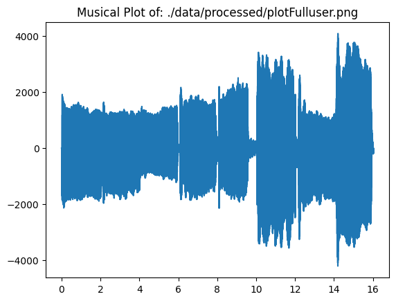
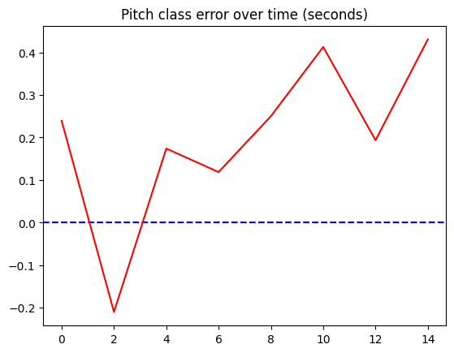

#This Project is developed to take a wav file of a single voice of music and get the musical pitch at any time frame.

Imports:


```python
import matplotlib.pyplot as plt
import numpy as np
import wave
import sys
import statistics
import random
import math
import librosa
import json
import os
import glob
```

Name of User (used in application)


```python
userId = 'user'
```

ONLY SET TO TRUE DURING TESTING: graphs every segment of audio (largely increases run time)


```python
fullgraph = False

if fullgraph == True:
    files = glob.glob('./data/processed/plotPartial/*.png')
    for f in files:
        os.remove(f)
```

Load audio file (only accepts .wav file)


```python
fileName = "sample7.wav"
originalFileLoc = "./data/raw/" + fileName
x, sr = librosa.load(originalFileLoc)
audioDuration = librosa.get_duration(y=x, sr=sr)
```

Set values


```python
#What decimal to round time / signal too
defaultDecimalRate = 5
#Rate to lower bit by
defaultLoweringRate = 3
#How long each frequency reading should be (in seconds)
defaultDurationTime = 0.1

defaultMinDist = defaultDurationTime

pitchToLetter = {
    0: 'C',
    1: 'C#',
    2: 'D',
    3: 'D#',
    4: 'E',
    5: 'F',
    6: 'F#',
    7: 'G',
    8: 'G#',
    9: 'A',
    10: 'A#',
    11: 'B'
}

pitches = {0: 65.406}
currentPitch = 0
while currentPitch <= 71:
    prevPitch = pitches[currentPitch]
    currentPitch += 1            
    pitches[currentPitch] = prevPitch * (2 ** (1/12))
```

(optional) show audio file for comparison (musicSample.png for demo)


```python
# music file = musicSample.png
timeListSample = [0, 2, 2, 4, 4, 6, 6, 8, 8, 10, 10, 12, 12, 14, 14, 16]
pitchListSample = [14, 14, 16, 16, 18, 18, 19, 19, 21, 21, 23, 23, 25, 25, 26, 26]

for i in range(len(pitchListSample)):
    pitchListSample[i] += 24

gradingDictSample = {}
for i in range(len(timeListSample) // 2):
    gradingDictSample[timeListSample[i * 2]] = {
        "startTime": timeListSample[i * 2],
        "pitchClass": pitchListSample[i * 2],
        "endTime": timeListSample[(i * 2) + 1]
    }

```

Get notes from freq


```python
def freqToNotes(freqList):
    retFreqList = []
    for x in freqList:
        if (x >= 65.406):
            retFreqList.append((12 * math.log((500 * x) / 32523)) / (math.log(2)))
        else: 
            retFreqList.append(-1)
    return retFreqList
```

Create Functions


```python
def is_close(a, b, tolerance=1e-2):
       return abs(a - b) < tolerance

def lowerRate(lst, rte, decimalRate):
    """(List of signal, updated rate (x))
    Used to lower bitrate by a factor of x to fix fuzz"""
    retList = []
    for i in range(int(len(lst) / rte) - 1):
        includedIndices = [lst[i * rte]]
        for j in range(rte):
            includedIndices.append(lst[(i * rte) + j + 1])
        retList.append(round(statistics.median(includedIndices),decimalRate))
    return (retList)
```

Pitch Analyzer Class:


```python

class PitchAnalyzer:
    def __init__(self, filename, decimalRate = defaultDecimalRate, loweringRate = defaultLoweringRate, minDist = defaultMinDist, durationTime = defaultDurationTime):
        self.decimalRate = decimalRate
        self.loweringRate = loweringRate
        self.minDist = minDist
        self.durationTime = durationTime
        self.freqDict = {}
        
        
        spf = wave.open(filename, "r")
        signal = spf.readframes(-1)
        signal = np.frombuffer(signal, np.int16)
        
        frameRate = spf.getframerate()
        
        timeList = []
        
        newDuration = (len(signal) / frameRate)
        if is_close(newDuration / 2, audioDuration): 
            for i in range(len(signal)):
                timeList.append(round((i / 2) / frameRate,self.decimalRate))
                
        else:
            for i in range(len(signal)):
                timeList.append(round(i / frameRate,self.decimalRate))
                

        
        
        
            
        if self.loweringRate != 1:
            signal = lowerRate(signal, self.loweringRate, self.decimalRate)
            timeList = lowerRate(timeList, self.loweringRate, self.decimalRate)
            
            
        self.signal = signal.copy()
        self.timeList = timeList.copy()
        self.length = timeList[-1]
        
    def createWavGraph(self, fileLoc):
        
        plt.figure(1)
        plt.title("Musical Plot of: " + fileLoc)
        plt.plot(self.timeList, self.signal)
        
        # for i in (changesOfDerivative):
        #     plt.plot(timeList[i], signal[i], 'ro')
        #     plt.annotate(f'({round(timeList[i],4)})', (timeList[i], signal[i]), textcoords="offset points", xytext=(0, 10), ha='center')
        # for i in (antiPeaks):
        #     plt.plot(timeList[i], signal[i], 'bo')
        
        plt.savefig(fileLoc)
        plt.show()
        plt.close()

        # plt.savefig('my_plot.png')
        
    def gradeSelf(self, gradingDict):
        
        #Grade by (weighed median towards lower grade / classic median)
        
        noteGradeList = []
        for i in gradingDict:
            currentGradedDict = gradingDict[i]
            
            userPitchList = []
            currentTime = currentGradedDict["startTime"]
            while currentTime <= currentGradedDict["endTime"]:
                currentTime = round(currentTime, defaultDecimalRate)
                if currentTime in self.freqDict:
                    userPitchList.append(self.freqDict[currentTime]['pitchClass'] + self.freqDict[currentTime]['cents_innacurate'])
                currentTime += defaultDurationTime
            
            pitchDifferenceList = []
            for j in userPitchList:
                pitchDifferenceList.append(min([((j%12) - (currentGradedDict["pitchClass"]%12)), ((j%12%5) - (currentGradedDict["pitchClass"]%12%5)), ((j%12%7) - (currentGradedDict["pitchClass"]%12%7))], key=abs))
            medianSquareError = statistics.median(pitchDifferenceList)
            noteGradeList.append(medianSquareError)
            
        
            
            
        return(noteGradeList)
            
    def createFinalGrade(self, gradingDict):
        noteGradeList = self.gradeSelf(gradingDict)
        retGrade = 100.0
        totalNotes = len(noteGradeList)
        for i in noteGradeList:
            thisGrade = abs(i) ** 2
            if thisGrade >= 1:
                thisGrade = 1
            retGrade -= thisGrade * (100/totalNotes)
        return(retGrade)
    
    def graphPitches(self, fileLoc):
        retFreqList = []
        retTimeList = []
        
        i = 0
        
        while i < self.length - 0.1:
            try:
                if fullgraph == False:
                    retFreqList.append(self.getPitchAtTime(i))
                if fullgraph == True:
                    retFreqList.append(self.getPitchAtTime(i, fileName = ("./data/processed/plotPartial/plot[t=" + str(round(i, defaultDecimalRate)) + "-" + str(round(i + self.durationTime, defaultDecimalRate)) + "]" + userId + ".png")))
                    print("Completed t=" + str(i) + "-" + str(i + self.durationTime))
                retTimeList.append(i)
            except Exception as err:
                print(err)
                pass

            i += self.durationTime
            
        
        
        if fullgraph == False: 
            specTimeLoc = retTimeList[random.randint(0,len(retTimeList) - 1)]
            self.getPitchAtTime(specTimeLoc, fileName = ("./data/processed/plotPartial" + userId + ".png"))
            
        self.createWavGraph(fileLoc = ("./data/processed/plotFull" + userId + ".png"))

        retFreqList = freqToNotes(retFreqList)

        timeFreqDict = {}
        for i in range(len(retTimeList)):
            currentPitchClass = retFreqList[i]
            currentNoteName = round(currentPitchClass, 0)
            currentNoteCents = currentPitchClass - currentNoteName
            currentNoteName %= 12
            currentNoteName = pitchToLetter[currentNoteName]
            retDict = {
                "pitchClass" : round(currentPitchClass, 0),
                "noteName" : currentNoteName,
                "cents_innacurate" : currentNoteCents,
            }
            timeFreqDict[round(retTimeList[i], defaultDecimalRate)] = retDict
            
        self.freqDict = timeFreqDict
        
        with open("./data/processed/timeFreq.json", "w") as outfile:
            json.dump(timeFreqDict, outfile)


        plt.figure(1)
        plt.title("Pitch class error over time (seconds)" )
        plt.axhline(y=0, color='blue', linestyle='--')
        plt.plot(timeListSample[::2], self.gradeSelf(gradingDictSample), color = 'red', label = "Inaccuracy")
        plt.show()
        plt.savefig(fileLoc)
        plt.close()    
        
        
        
         


    def getPitchAtTime(self, startTime, fileName = False, durationTime = False):
        """(Start time in seconds, End time in seconds, name of .wav file)
        Returns most common frequency at the listed time"""
        
        #MEW IDEA TO GO THROUGH ALL FREQUENCIES IN LIST AND ONLY TAKE SIMILAR ~90% values to lowest value, acceptableFreqPercent variable
        
        if (durationTime == False):
            durationTime = self.durationTime
        
        decimalRate = self.decimalRate
        
        startTime = round(startTime, decimalRate)
        durationTime = round(durationTime, decimalRate)
        
        signal = self.signal.copy()
        timeList = self.timeList.copy()
    
        while(startTime not in timeList):
            startTime = round(startTime + 1 / 10 ** decimalRate,decimalRate)
        startIndex = int(timeList.index(startTime))
        while (startTime + durationTime not in timeList):
            durationTime += 1 / 10 ** decimalRate
            durationTime = round(durationTime, decimalRate)
        endIndex = int(timeList.index(startTime + durationTime))

        signal = signal[startIndex:endIndex]

        fft_output = np.fft.fft(signal)
        n = len(signal)
        frequencies = np.fft.fftfreq(n, d=1/sr)

        retFreq = abs(frequencies[np.argmax(np.abs(fft_output))])
        
        if (fileName != False):
        
            plt.figure(figsize=(10, 5))
            plt.title("Musical Plot of: " + fileName + ", Current Freq = " + str(retFreq))
            plt.plot(frequencies[:n//2], np.abs(fft_output[:n//2]))
            plt.xlabel('Pitch Class Difference')
            plt.ylabel('Magnitude')
            plt.grid(True)

            plt.savefig(fileName)
            plt.close()
        
        return(retFreq)
```

Create analyzer


```python
thisAnalyzer = PitchAnalyzer(originalFileLoc)
```

Graph all pitches


```python
thisAnalyzer.graphPitches("./data/processed/pitchesPlotFull" + userId + ".png")
```


    

    


    

    


```python
print(thisAnalyzer.gradeSelf(gradingDictSample))
print(thisAnalyzer.createFinalGrade(gradingDictSample))
```

    [0.23931713689383116, -0.2099768665013073, 0.17405693067479433, 0.11882025044555888, 0.25013396979222335, 0.4128516199272525, 0.19360693932866369, 0.4307288548979109]
    92.4774812521613

